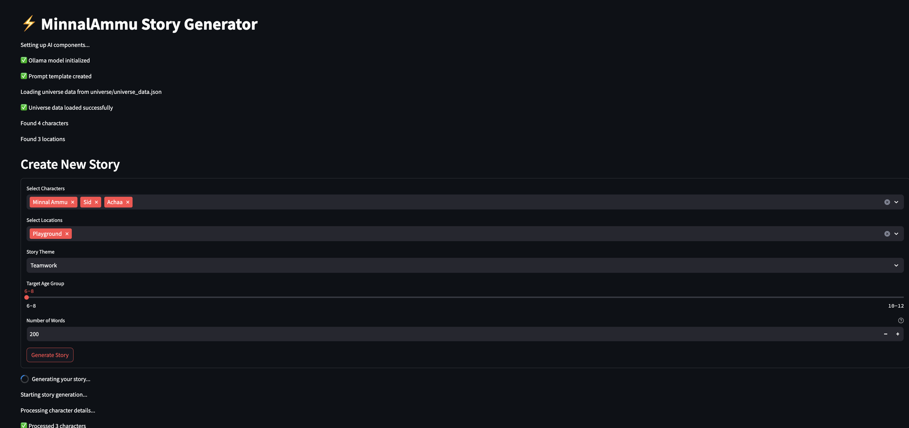
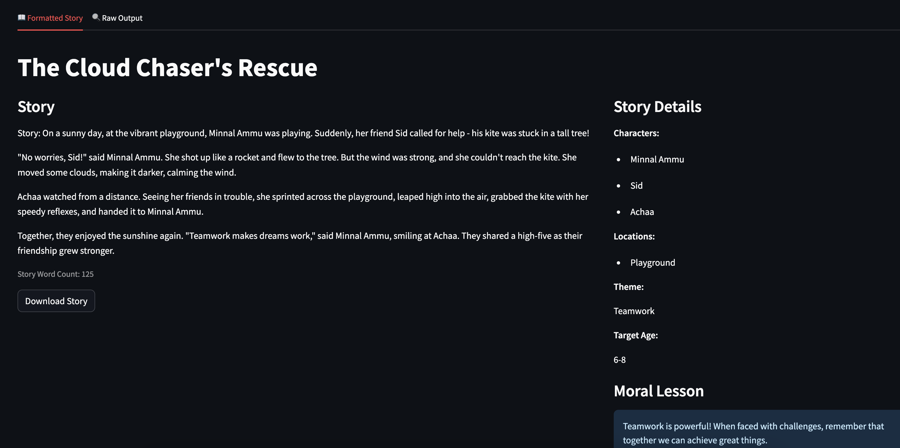

# AI Storytelling System

A system for generating and managing a superhero story universe using AI. The system consists of three main components:
- Universe Builder (universe_builder.py)
- Story Generator (story_generator_app.py)
- Universe Integration (universe_integration.py)

## Prerequisites

- Python 3.9 or higher
- Homebrew (for Mac)
- Git

## Installation

1. Clone the repository:
```bash
git clone <repository-url>
cd MinnalAmmu_Universe
```

2. Create and activate virtual environment:
```bash
# Create virtual environment
python -m venv venv

# Activate virtual environment
# On macOS/Linux:
source venv/bin/activate
```

3. Install required packages:
```bash
pip install -r requirements.txt
```

## Setting up Ollama

1. Install Ollama:
```bash
# On macOS:
brew install ollama
```

2. Start Ollama service:
```bash
# Start Ollama service
brew services start ollama

# Verify service is running
brew services list
```

3. Pull the Mistral model:
```bash
ollama pull mistral
```

4. Verify model installation:
```bash
ollama list
# Expected output:
# NAME              ID              SIZE      MODIFIED
# mistral:latest    [ID]            4.1 GB    [timestamp]
```

## Running the Application

1. Ensure Ollama service is running:
```bash
brew services list
# Should show ollama as "started"
```

2. Start the Universe Builder:
```bash
streamlit run universe_builder.py
```

3. Create your superhero universe by adding:
- Characters
- Locations
- Relationships
- Events

4. Generate stories:
```bash
streamlit run story_generator_app.py
```

## Demo - Minnal Ammu Story Generation
Here are some screenshots demonstrating the key features of the system:

### Generating a story - select characters from univers, location etc.


### A sample Generated story

