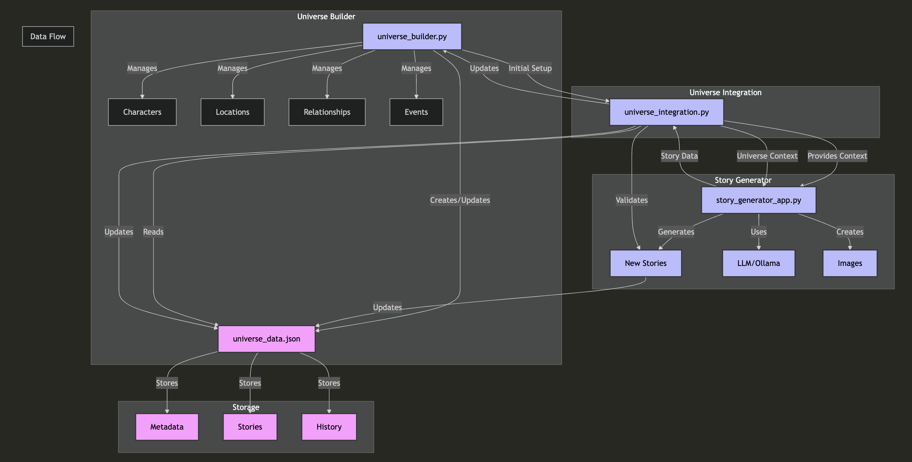
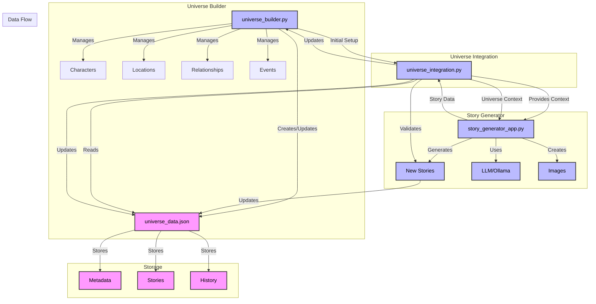

# Minnal Ammu - An AI-powered Superhero Story Generator 
### An AI-powered superhero story generator that brings Minnal Ammu's adventures to life through dynamic narratives and images in a continuously evolving universe.

Minnal Ammu is a superhero character I created a few years ago for bedtime stories with my daughter. In this project, I am building a universe for Minnal Ammu.
Minnal Ammu is an innovative story generation project that creates dynamic superhero narratives centered around its titular character, Ammu. The project combines advanced language models with image generation capabilities to produce immersive storytelling experiences within a consistent universe.

## Project Overview

Minnal Ammu (Lightning Ammu) is a story generation system that creates unique superhero adventures while maintaining continuity within its established universe. The project leverages artificial intelligence to weave together compelling narratives that are both entertaining and coherent with the existing story world.

## System Architecture

The system architecture consists of four main components that work together to build and manage the story universe:

1. Universe Builder: The core component that manages the fundamental elements of the story universe including characters, locations, relationships, and events. It maintains all this data in universe_data.json.

2. Story Generator: Leverages LLM/Ollama to generate new stories and images, integrating them into the existing universe data. It actively uses the universe context to ensure story coherence.

3. Universe Integration: Acts as a middleware that manages data flow between components, validates new stories, and ensures proper integration with the existing universe.

4. Storage: Handles persistent storage of all universe data including metadata, stories, and historical records.

The components interact in a cyclic flow where the Universe Builder provides initial setup, Universe Integration provides context to Story Generator, and new stories are validated and integrated back into the universe.

<!--  -->

## License

MIT License

Copyright (c) 2024 Sonish Balan

Permission is hereby granted, free of charge, to any person obtaining a copy
of this software and associated documentation files (the "Software"), to deal
in the Software without restriction, including without limitation the rights
to use, copy, modify, merge, publish, distribute, sublicense, and/or sell
copies of the Software, and to permit persons to whom the Software is
furnished to do so, subject to the following conditions:

The above copyright notice and this permission notice shall be included in all
copies or substantial portions of the Software.

THE SOFTWARE IS PROVIDED "AS IS", WITHOUT WARRANTY OF ANY KIND, EXPRESS OR
IMPLIED, INCLUDING BUT NOT LIMITED TO THE WARRANTIES OF MERCHANTABILITY,
FITNESS FOR A PARTICULAR PURPOSE AND NONINFRINGEMENT. IN NO EVENT SHALL THE
AUTHORS OR COPYRIGHT HOLDERS BE LIABLE FOR ANY CLAIM, DAMAGES OR OTHER
LIABILITY, WHETHER IN AN ACTION OF CONTRACT, TORT OR OTHERWISE, ARISING FROM,
OUT OF OR IN CONNECTION WITH THE SOFTWARE OR THE USE OR OTHER DEALINGS IN THE
SOFTWARE.